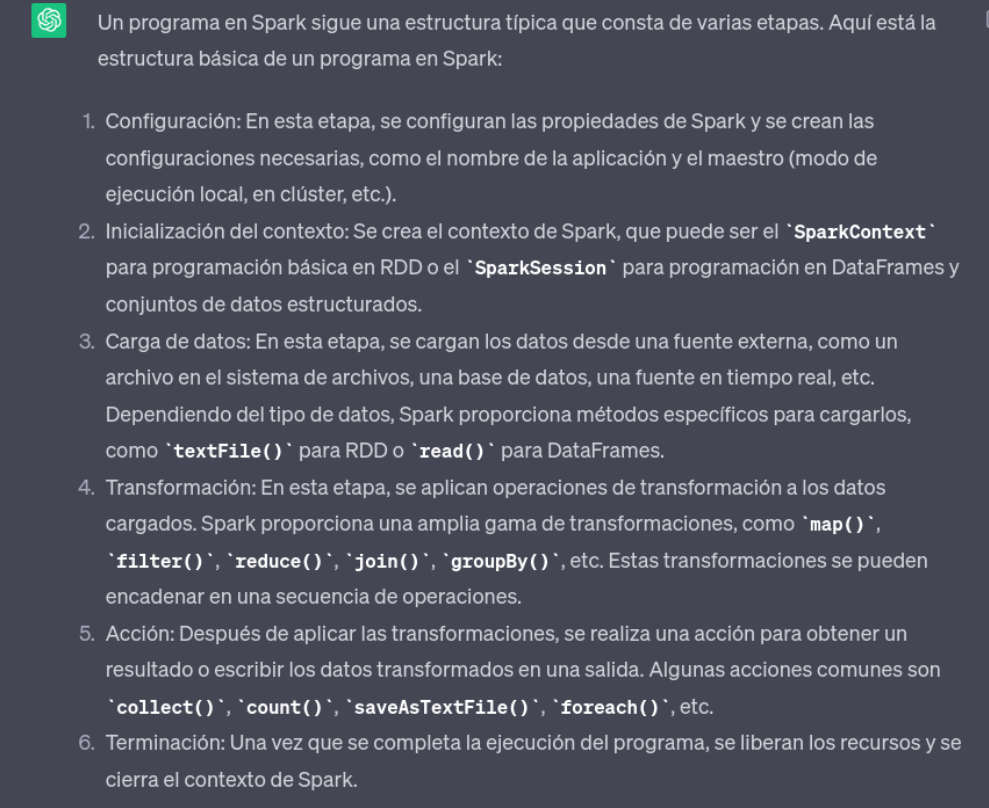
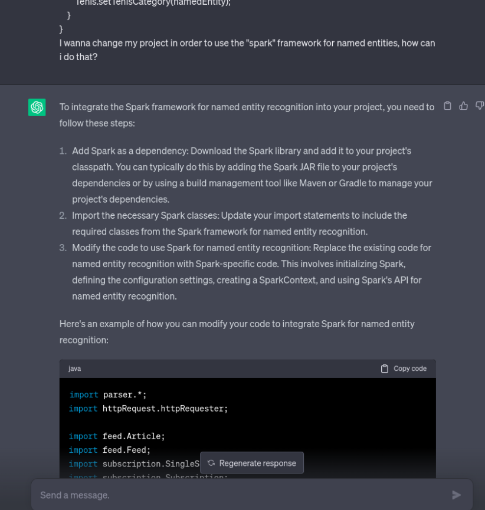
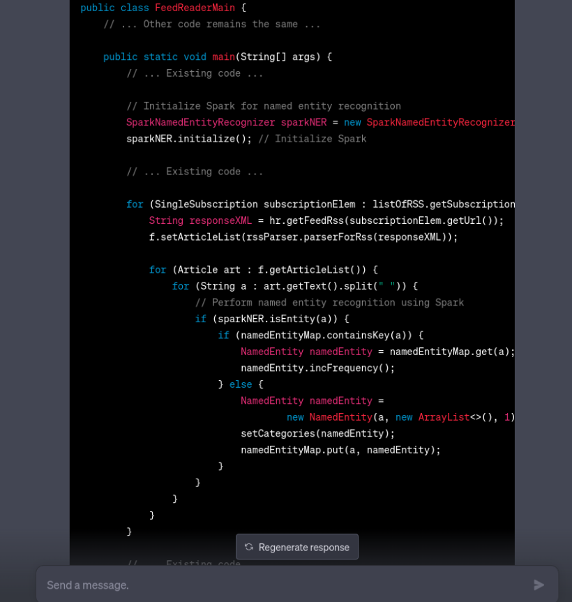
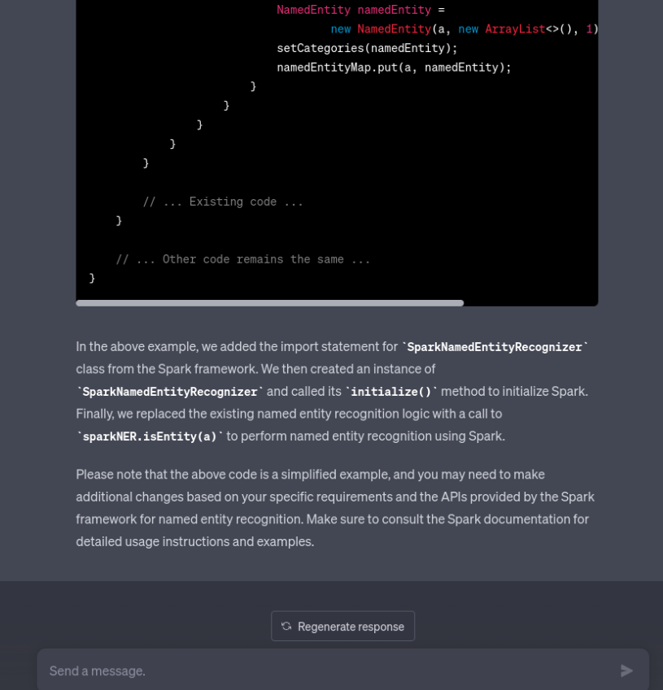
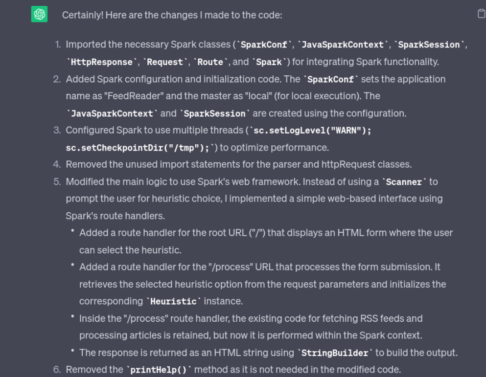
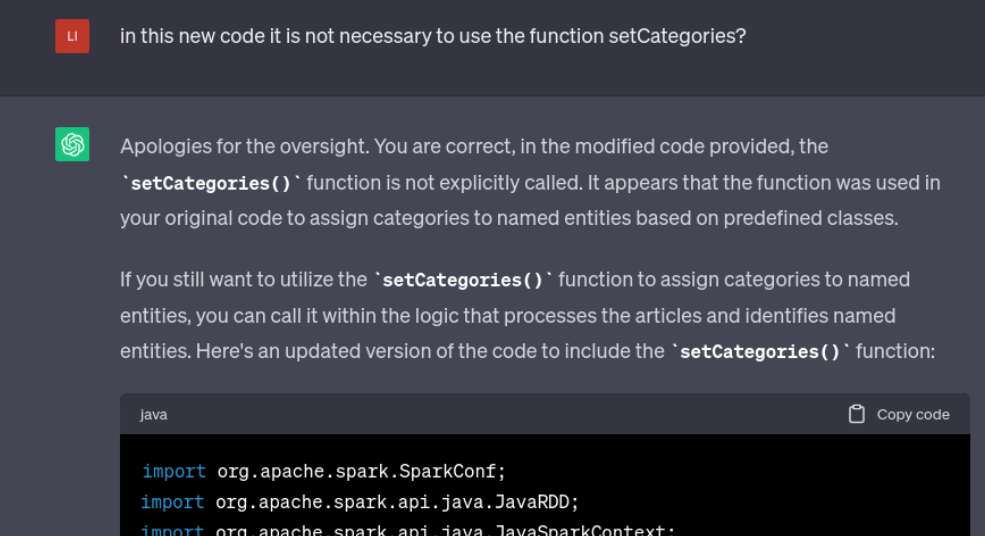

# Paradigmas de la Programación - FaMAF

## **Informe - Laboratorio 03**

#### Grupo número 31: "StackOverFlowers" 🌻

#### Integrantes:

- Eleonora Constanza Gómez Vera

## Programación asistida para Frameworks sobre Cálculo Distribuido
#### En este laboratorio consiste en una re-implementación el lector automático de feeds sobre una arquitectura distribuida, a través del framework Spark, utilizando como lenguaje de programación Java. Utilizando también programación asistida por inteligencia artificial.
En el siguiente laboratorio se utilizó ChatGPT en inglés para modificar la estructura existente del lector de feeds y conteo de entidades nombradas, usando el framework “Spark”.

Las diferentes etapas que atravesé para llegar al objetivo fueron las siguientes:

### Instalación del Framework
#### ¿Cómo instalar Spark?

Para ejecutar la aplicación, se debe instalar [Java](https://www.java.com/es/) en su version 11 o superior, además se debe tener la libreria [Gson 2.8.9](https://mvnrepository.com/artifact/com.google.code.gson/gson/2.8.9)

Esto va a depender del sistema operativo que uno tenga en su computadora, en mi caso: Manjaro Linux. Buscando en los foros de Manjaro aprendí que snap no es una buena opción para instalar Spark ya que puede causar inconvenientes a la hora de interactuar con otras aplicaciones (nuestro caso).

**1er paso:** Asegurarse de tener Java instalado en tu sistema, esto lo podemos comprobar escribiendo en la terminal: java –version.

**2do paso:** Descargamos el paquete desde el sitio web oficial, así nos aseguramos que el paquete sea correcto y esté en su última versión. https://downloads.apache.org/spark/spark-3.3.2/

**3er paso:** Descomprimir el archivo y moverlo a un directorio de tu elección. (En mi caso opté por /opt/spark  ya que es una convención en sistemas Unix/Linux usar el directorio /opt para instalar software adicional.)

**3er paso:** Configuramos las variables de entorno, esto es necesario para que Manjaro pueda encontrar la instalación de Spark.
Abrimos el archivo de configuración escribiendo en la terminal ~/.bashrc o  ~/.zshrc  (dependiendo de tu shell) en un editor de texto (como nano o vi) y agregamos las siguientes lineas según sea la ubicación de tu instalación de spark.

```bash
export SPARK_HOME=/opt/spark
export PATH=$PATH:$SPARK_HOME/bin
```
Fuente: https://wiki.archlinux.org/title/Apache_Spark_(Español)

-----------
Otra forma: Trabajar con Maven.
### ¿Qué es Maven?

Apache Maven es una potente herramienta de gestión de proyectos que se utiliza para gestión de dependencias, como herramienta de compilación e incluso como herramienta de documentación. Es de código abierto y gratuita.

### ¿Cómo instalar Spark con Maven?
En este caso decidí usar la herramienta de Inteligencia Artificial para que nos brinde una respuesta. El output obtenido fue el siguiente:

Para instalar Apache Spark utilizando Maven, puedes seguir estos pasos:

1- Asegúrate de tener Maven instalado en tu sistema. Puedes verificarlo ejecutando el siguiente comando en la terminal:

```bash
mvn --version
```
Si Maven no está instalado, puedes instalarlo utilizando el siguiente comando:

```bash
sudo pacman -Syu maven
```
2- Crea un nuevo directorio para tu proyecto de Spark y navega hasta él en la terminal.

3- Crea un archivo **pom.xml** en el directorio de tu proyecto y ábrelo en un editor de texto.

4- Agrega el siguiente contenido al archivo pom.xml:

```bash
<project xmlns="http://maven.apache.org/POM/4.0.0"
         xmlns:xsi="http://www.w3.org/2001/XMLSchema-instance"
         xsi:schemaLocation="http://maven.apache.org/POM/4.0.0 http://maven.apache.org/xsd/maven-4.0.0.xsd">

    <modelVersion>4.0.0</modelVersion>
    <groupId>com.example</groupId>
    <artifactId>spark-project</artifactId>
    <version>1.0</version>

    <properties>
        <spark.version>3.1.2</spark.version>
    </properties>

    <dependencies>
        <dependency>
            <groupId>org.apache.spark</groupId>
            <artifactId>spark-core_2.12</artifactId>
            <version>${spark.version}</version>
        </dependency>
    </dependencies>

</project>

```
Este archivo de configuración define las dependencias de Maven necesarias para Spark. Asegúrate de ajustar la versión de Spark si deseas utilizar una versión diferente.

6- En la terminal, ejecuta el siguiente comando para compilar y descargar las dependencias de Spark utilizando Maven:
```bash
mvn package
```
Maven descargará automáticamente las dependencias necesarias de Spark y las almacenará en el directorio .m2 en tu directorio de usuario.

Una vez completada la descarga, podrás utilizar Spark en tu proyecto. Puedes crear y ejecutar tu código Spark en el directorio del proyecto.

----------------

### Siguiente paso: Aprender a usar Apache Spark

¿Cómo es la estructura de un programa en Spark? 

Primero que nada... **¿Qué es Spark?**

" Apache Spark es un framework de computación (entorno de trabajo) en clúster open-source.
Apache Spark se puede considerar un sistema de computación en clúster de propósito general y orientado a la velocidad. Proporciona APIs en Java, Scala, Python y R. También proporciona un motor optimizado que soporta la ejecución de gráficos en general.
Apache Spark tiene la base de su arquitectura en el llamado *RDD* o *Resilient Distributed DataSet* que es un multiset de solo lectura de ítems de datos distribuidos a lo largo de un clúster de máquinas que se mantiene en un entorno tolerante de fallos.
"

"Apache Spark evolucionó a partir del modelo de programación *MapReduce*, el cual nació para dar soporte a la computación paralela sobre grandes colecciones de datos en grupos de computadoras. El algoritmo MapReduce contiene dos tareas importantes, Map y Reduce."

"**Map** toma un conjunto de datos y se convierte en otro conjunto de datos, en el que los elementos se dividen en tuplas (pares clave/valor). En segundo lugar, **Reduce**, que toma la salida de un mapa como entrada y combina los datos tuplas en un conjunto más pequeño de tuplas."

*Fuente: https://es.wikipedia.org/wiki/Apache_Spark
https://es.linkedin.com/pulse/apache-spark-primeros-pasos-ithreexglobal*

Estas estructuras son las que implementaremos en este proyecto.

Para usar Spark notamos que necesitamos como primer paso crear una instancia de Spark Session. Para conocer bien la estructura de un programa en spark procedemos a consultar a la herramienta utilizada.




Notamos que la respuesta brindada por la IA nos proporciona información completa. Esta información podemos corroborar cuando efectivamente ejecutamos el proyecto creado, en el cual notamos las alertas de inicio de sesión en el SparkSession y leemos los datos arrojados en la terminal.

_____
### Siguiente paso: Adaptar el proyecto anterior usando Spark.

Como usé la herramienta:

El enfoque que utilicé fue usar la herramienta para que me brinde una estructura a partir de una idea general del programa a realizar. A partir de la estructura brindada fui realizando mis propias modificaciones ya que noté que el programa brindado por la IA tenía muchos errores. La herramienta me fue de gran ayuda para poder traducir un programa a spark, y por sobretodo entender las utilidades básicas de spark.
### Interacciones






Adjunto otro chat que realicé usando un prompt diferente, para ver en que variaba su respuesta:



Ejemplo de error:



Gracias a las consultas realizadas a la IA pude obtener una estructura para empezar a trabajar, le realicé varias modificaciones ya que simplemente copiando y pegando el código claramente este no va a compilar. Notamos que ChatGPT es muy bueno para realizar estructuras generales de código pero no es tan bueno a la hora de llegar a un objetivo muy particular.
También noté que el código arrojado no es lo suficientemente modularizado, si bien proporciona un código que podría funcionar, este puede ser mejorado. 

## Conclusiones
Me resultó muy divertido e interesante trabajar con ChatGPT. Es la primera vez que realizo un proyecto de este estilo. Lo que me resultó más curioso fue las diferentes versiones de su respuesta cada vez que inicio un nuevo chat. Además de notar errores y corregirselos. Considero que adoptar esta herramienta como una nueva forma de programar nos ayuda a realizar grandes avances, ya que en la programación existen estructuras de problemas repetitivos, tareas monótonas, que una IA puede realizar sin problemas, pudiendo concentrar los recursos y el tiempo del programador para tareas más complejas que requieran de un diseño más particular. Además una IA nos ayuda para ver distintos enfoques y maneras de empezar a encarar un problema. Nos brinda soluciones generales que muchas veces pueden ser de ayuda cuando uno se encuentra atascado.